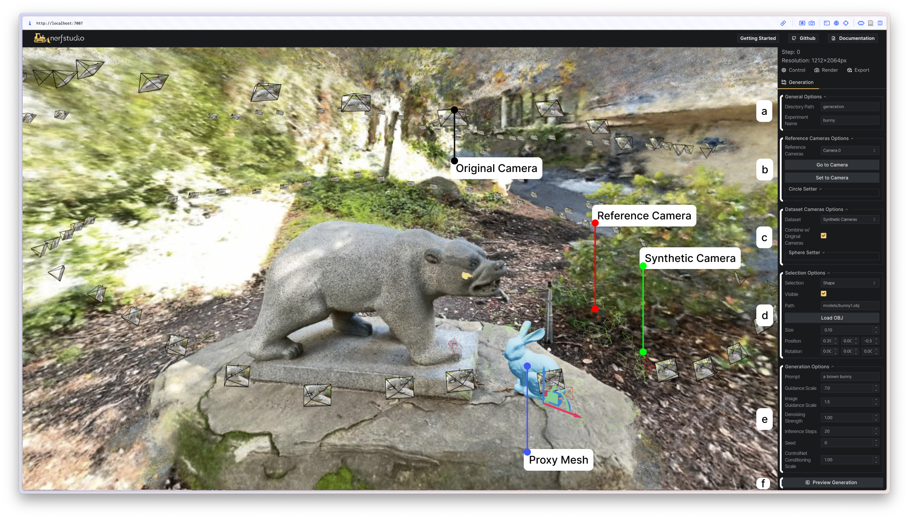
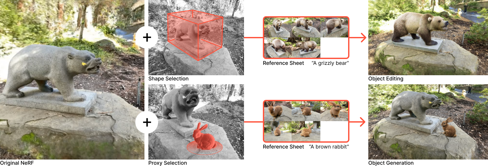

# SIGNeRF

<p align="left">
  <strong>
    Scene Integrated Generation for Neural Radiance Fields (CVPR 2024)
  </strong>
</p>

https://github.com/cgtuebingen/SIGNeRF/assets/9963865/e52d1abd-d58e-431e-b220-4489acece6d2

<p align="center">
    <span> 🌐  <a href="https://signerf.jdihlmann.com/"> Project Page </a> </span>&nbsp;&nbsp;&nbsp;
    <span> 📄  <a href="http://arxiv.org/abs/2401.01647"> Paper (Arxiv) </a> </span>&nbsp;&nbsp;&nbsp;
    <span> 📺  <a href="https://www.youtube.com/playlist?list=PL5y23CB9WmildtW3QyMEi3arXg06zB4ex"> Videos </a> </span>&nbsp;&nbsp;&nbsp;
    <span>  📦  <a href="https://drive.google.com/drive/folders/1biG8b-K3X2RyZoRVBnzTZolBsn92Qh2V?usp=sharing"> Materials </a> </span>&nbsp;&nbsp;&nbsp;
    <span>  ✍🏻
     <a href="https://github.com/cgtuebingen/SIGNeRF?tab=readme-ov-file#citation"> Citation </a> </span>&nbsp;&nbsp;&nbsp;
</p>

# About

SIGNeRF got accepted to [CVPR 2024](https://cvpr.thecvf.com/) - [Poster Information](https://cvpr.thecvf.com/virtual/2024/poster/31835)

SIGNeRF allows for generative 3D scene editing. We present a novel approach to combine [NeRFs](https://www.matthewtancik.com/nerf) as scene representation with the image diffusion model [StableDiffusion](https://github.com/Stability-AI/stablediffusion) to allow fast and controlled 3D generation.

> In more detail we find that the depth-conditioned diffusion model [ControlNet](https://github.com/lllyasviel/ControlNet) inherently possess the capability to generate 3D consistent views by requesting a grid of images instead of single views. Based on these insights, we introduce a multi-view reference sheet of modified images. Our method updates an image collection consistently based on the reference sheet and refines the original NeRF with the newly generated image set in one go. By exploiting the depth conditioning mechanism of the image diffusion model, we gain fine control over the spatial location of the edit and enforce shape guidance by a selected region or an external mesh.

# Installation

SIGNeRF utilizes [Nerfstudio](https://docs.nerf.studio/) for NeRF training and its 3D viewer [Viser](https://viser.studio/) for interactive selection and interfaced-based generation. For image generation, we depend on [Stable Diffusion Web UI](https://github.com/AUTOMATIC1111/stable-diffusion-webui) and the [ControlNet Extension](https://github.com/Mikubill/sd-webui-controlnet).

## 1. Nerfstudio Setup

For the installation of [Nerfstudio](https://docs.nerf.studio/) follow their [Installation Guide](https://docs.nerf.studio/quickstart/installation.html), if you have any issues we recommend joining their [Discord](https://discord.gg/uMbNqcraFc).

## 2. Stable Diffusion Web UI Setup

For the installation of [Stable Diffusion Web UI](https://github.com/AUTOMATIC1111/stable-diffusion-webui) follow their [Installation Guide](https://github.com/AUTOMATIC1111/stable-diffusion-webui?tab=readme-ov-file#installation-and-running), they also provide a [Discord](https://discord.gg/7vzr8jv) for support. To get the exact version we used, please use the following commands to clone the repository and checkout the commit.

```bash
git clone https://github.com/AUTOMATIC1111/stable-diffusion-webui.git
```

```bash
cd stable-diffusion-webui
```

```bash
git checkout 5ef669de080814067961f28357256e8fe27544f4
```

Verify the installation by running the following command, `--xformers` is optional but allows for a significant speedup. The `--api` flag is required such that we can interface with the model.

```bash
bash webui.sh --port 5000 --no-half --xformers --api
```

### 2.1. ControlNet Extension

After the installation of Stable Diffusion Web UI, you need to add the [ControlNet Extension](https://github.com/Mikubill/sd-webui-controlnet). You can follow their guide on [GitHub](https://github.com/Mikubill/sd-webui-controlnet) or simply go to the extensions tab after starting Stable Diffusion Web UI click on the `Install from URL` button and paste the following URL: `https://github.com/Mikubill/sd-webui-controlnet.git`. We used the commit [a43e574...](https://github.com/Mikubill/sd-webui-controlnet/commit/a43e574254d19a362082bbd412f24aeef1beed47) for the extension.

### 2.2. Model Weights

In order to use Stable Diffusion Web UI with ControlNet you need to download the weights for the Stable Diffusion XL model and the ControlNet depth model.

#### Stable Diffusion Weights

You can find the weights for the Stable Diffusion model [here](https://huggingface.co/stabilityai/stable-diffusion-xl-base-1.0/tree/main) we use the `sd_xl_base_1.0.safetensors` model. SIGNeRF is independent of the SD version meaning that you can either use previous versions like SD 1.5 or apply newer versions in the future without any changes to the code.

Place the downloaded weights in `stable-diffusion-webui/models/Stable-diffusion`

#### ControlNet Weights

You can find the weights for the ControlNet model [here](https://huggingface.co/lllyasviel/sd_control_collection/tree/main) we use the `diffusers_xl_depth_full.safetensors` model. However, you can also use the smaller models, which require less VRAM see in the [Hardware Requirements](#hardware-requirements) section for more information.

Place the downloaded weights in `stable-diffusion-webui/models/ControlNet`

## 3. SIGNeRF Setup

> Only continue if you have installed and setuped the dependencies above

Install SIGNeRF with the following command

```bash
pip install git+https://github.com/cgtuebingen/SIGNeRF
```

Optional: If you would like to work with the code directly, clone then install the repo:

```bash
git clone https://github.com/cgtuebingen/SIGNeRF
cd signerf
pip install --upgrade pip setuptools
pip install -e .
ns-install-cli
```

You can verify the installation by running `ns-train -h` the list should include `signerf`

### 3.1. SIGNeRF Configuration

To fit into your previous installations you need to adjust the configuration of SIGNeRF.

#### Model Weights Configuration

SIGNeRF sets the models within Stable Diffusion Web UI therefore you need to manually set the models name. Launch the Stable Diffusion Web UI with the following command:

```bash
bash webui.sh --port 5000 --no-half --xformers --api
```

Open the web interface [http://127.0.0.1:5000/](http://127.0.0.1:5000/) on the top left you can see the model name of the Stable Diffusion model, copy the full name it should look similar to this `sd_xl_base_1.0.safetensors [31e35c80fc]`probably with a different commit hash. Do the same for the ControlNet model name, by opening the ControlNet extension and selecting the downloaded model, copy the full name with the commit hash.

You have multiple options to set the model names, either go directly to the `/signerf/signerf_config.py` and exchange the strings in the `DiffuserConfig` for `stable_diffusion_model` and `controlnet_model`. Or append the following flags to the `ns-train` command (replace with your model names):

```bash
ns-train signerf ... \
--pipeline.dataset-generator.diffuser.stable-diffusion-model 'sd_xl_base_1.0.safetensors [31e35c80fc]' \
--pipeline.dataset-generator.diffuser.controlnet_model 'diffusers_xl_depth_full [2f51180b]'
```

You can do this within SIGNeRF diffuser class in `/signerf/diffuser/diffuser.py` see more in the [SIGNeRF Setup](#signerf-setup) section.

#### SD Web UI Server

If you run the Stable Diffusion Web UI on a different machine or port you need to adjust the `url` and `port` the `DiffuserConfig` in `/signerf/signerf_config.py` or append the following flag to the `ns-train` command (replace with your server):

```bash
ns-train signerf ... \
--pipeline.dataset-generator.diffuser.url 'http://127.0.0.1' \
--pipeline.dataset-generator.diffuser.port 5000
```

# Usage

## Training

### 1. Train a NeRF model with Nerfstudio NeRFacto

In order to edit a NeRF we have to train a regular NeRF model first. Please refer to the [Nerfstudio Documentation](https://docs.nerf.studio/) for more information on processing your data
To edit a NeRF, you must first train a regular `nerfacto` scene using your data. To process your custom data, please refer to this documentation.

After processing your data, you can train a NeRF model using the following command:

```bash
ns-train nerfacto --data {PROCESSED_DATA_DIR}
```

### 2. Launch Stable Diffusion Web UI

After training the NeRF model, you need to launch the Stable Diffusion Web UI with the ControlNet extension. You can do this by running the following command:

```bash
bash webui.sh --port 5000 --no-half --xformers --api
```

Again `xformers` is optional but allows for a significant speedup. The `api` flag is required such that we can interface with the model. If you change the port or run the server on a different machine, you need to adjust the config see [SIGNeRF Configuration](#signerf-configuration) section.

### 3. Train a SIGNeRF model

Start the SIGNeRF interface by running the following command:

SIGNeRF is an extension to Nerfstudio, therefore you can use the same commands for training a normal NeRF model. We provide a new `signerf` command, which allows you to train a SIGNeRF model. The following command will train a SIGNeRF model with the default settings.

```bash
ns-train signerf \
--output-dir ./outputs \
--data {PROCESSED_DATA_DIR} \
--pipeline.model.predict_normals True\
--load_dir {PATH_TO_TRAINED_NERFACTO_MODEL}/nerfstudio_models
```

#### Interface Mode

SIGNeRF will automatically launch in the interface mode without directly starting the training, waiting for your input. Open the viewer under the logged URL (usually [http://127.0.0.1:7007](http://127.0.0.1:7007)). You can find all the settings under the `Generation` tab on the right side. After you have set all the settings, you can start the training by clicking the `Generate Dataset & Train` button. For more information on how the interface works, please refer to the [Selection Modes](#selection-modes) section.

#### Command Line Mode

You can also interface SIGNeRF with the command line by setting the config via command line args to see all available flags run `ns-train signerf --help` where the `--pipeline.dataset-generator` flags are the most important. You can also set the config in the `signerf_config.py` file in the `signerf` folder and look for settable parameters in `/signerf/datasetgenerator/datasetgenerator.py`, `/signerf/diffuser/diffuser.py` and `/signerf/renderer/renderer.py`.

#### Training Process

After starting the training, SIGNeRF will:

- Generate a dataset based on the selected views and specified settings
- Train the model with the newly generated dataset.

You can follow the generation and training process in the terminal and the web interface.

#### Load previous experiments

By extending the `ns-train` command with the `--previous_experiment_dir` flag you can load a previous experiment and all the configurations you made. If the `transforms.json` file is present in the directory, the reference and if available the synthetic images will be loaded.

```bash
ns-train signerf ... --previous_experiment_dir {PREVIOUS_EXPERIMENT_DIR}
```

> Beware that the `stable_diffusion_model` and `controlnet_model` versions are stored within the config and loaded from the previous experiment, you need to overwrite them in the config if you have a different checkpoint. Same goes for the `url` and `port` of the Stable Diffusion Web UI server.

#### Skipping parts of the pipeline

If you want to start generating and training without the interface, you can skip the interface by setting the `--skip_interface True` flag. However, a previous experiment with `transforms.json` file is required and needs to be specified with the `--previous_experiment_dir` flag.

Further, if you previously generated the dataset and want to start the training directly you can skip the generation by setting the `--skip_generation True`. Here a full generated dataset is required and needs to be specified with the `--generated_dataset_dir` flag.

> Important Note: When using `--skip-interface True` close the viewer (browser tab) as it might interfer with rendering.

#### Training variants

In most cases `ns-train signerf ...` will result in the best quality, however it might be slow. If you want to speed up the training process you can use the `ns-train signerf_nerfacto ...` which trains a simple nerfacto model on the generated datasets. This is faster but might result in lower quality. (Beware to set you stable diffusion models in the `signerf_nerfacto_config.py`)

You can also use the generated dataset to train a normal nerfacto model with:

```bash
ns-train nerfacto --data {GENERATED_DATASET_DIR}` ...
```

Or even use splatfacto to train a model with Gaussian Splatting:

```bash
ns-train splatfacto --data {GENERATED_DATASET_DIR}` ...
```

However, the best results are achieved with the `signerf` command, we are currently looking into how to bring the full quality of the pipeline to Gaussian Splatting, stay tuned.

> With the current version of Nerfstudio training with masks is pretty slow see [Issue #3040](https://github.com/nerfstudio-project/nerfstudio/issues/3040) when using a patch pixel sampler. We therefore disable patch training for now when using masks. However, this might result in slightly worse results than in the paper. Beware of this when training a scene where the generated dataset is merged with the original dataset.We hopping for a fix in the future.

## Interface


On the left side, you can see the 3D viewer, where you can interact with the scene. On the right side, you can find the settings for the generation process. The settings are divided into multiple tabs: (a) `General`, (b) `Reference Camera`, (c) `Dataset Cameras`, (d) `Selection`, (e) `Generation`, (f) `Preview`. Most of these options are explained in the following sections. After you have set all the settings, you can start the training by clicking the `Generate Dataset & Train` button (not visible in the image, scroll up).

> A video using the interface will be available soon.

### Reference Camera

The reference cameras are one of the most important aspects of SIGNeRF and need to be placed carefully. Place the cameras around the object such that the object is visible from all angles and the object is centered in the view. You can extend the `Circle Setter` to place the cameras in a circle around the object. You can also place the cameras manually by clicking on the `Set to Camera` button to place the camera in the current position in the 3D viewer. Use the `Go to Camera` and dropdown menu to view the scene from the camera perspective. For more information on the reference cameras, please take a look at our [paper](http://arxiv.org/abs/2401.01647) or use one of the provided examples.

### Dataset Cameras

After you have placed the reference cameras, you can set the dataset cameras. The dataset cameras are used to generate the dataset for the training and are placed in the generated reference sheet.

#### Original Cameras

The dataset cameras are used to generate the dataset for the training. You can either choose to take the original dataset cameras. This is best used when you want to change something similar in scale to the original scene (e.g. changing the bear into a grizzly).

#### Synthetic Cameras

If you want to generate a new object into the scene, that is smaller and not centered in the original cameras we recommend using the `Synthetic` Cameras`. The synthetic cameras should be placed similarly to the reference cameras around the object. You can use the `Sphere Setter` to place the cameras in a sphere around the object. The synthetic cameras will be used to generate the dataset for the training.

If you do not want to lose the original scene structure you can set `Combine w/ Original Cameras` to `True` and the original cameras will be added to the dataset with an inverted mask. This will result in a dataset that contains the original scene and the new object.

### Selection Modes

#### AABB Selection

Best used to select regions in the scene that should be changed, e.g. a bear that should be turned into a grizzly. Select `AABB` in the `Selection` tab and place the bounding box in the 3D viewer. The bounding box will be compared against the depth map of the rendered cameras and the region will be selected.

#### Shape Selection

Best used to generate new objects into the scene and guide them with a mesh. Select `Shape` in the `Selection` tab and load a mesh in the `Shape` tab. Load the mesh by entering a path on your host machine and then clicking the `Load OBJ` button and selecting the mesh file. Place the mesh at the location where you want the new object to be generated. The mesh will be compared against the depth map of the rendered cameras and combined with the depth of the scene. If you export an obj from Blender be sure to `Y Forward` and `Z Up`.

### Generation

We provide the typical settings for the generation process. For the `Prompt` we recommend describing the full scene. The `ControlNet Condition` should be relatively high (0.85 - 1.0). For more information please take a look at our supplementary material in the [paper](http://arxiv.org/abs/2401.01647).

### Preview

We highly recommend previewing the generated images before starting the training, with the `Preview Generation` button (if not visible, scroll down). This allows you to see the quality of the generated images and adjust the settings if necessary. The higher the multi-view consistency within the reference sheet, the better the results will be. If the images are not consistent, the training will not be successful. The generation will take ~20sec, and longer for the first request to Stable Diffusion Web UI.

# Training

### Hardware Requirements

For training, we utilize a two GPU setup with a NVIDIA 2080 Ti (11GB) and a NVIDIA 3090 (24GB) / NVIDIA 4090 (24GB). The first and smaller GPU is used for training the NeRF with Nerfstudio, here one could also use an even smaller GPU. The second bigger GPU is used to host Stable Diffusion Web UI server with the ControlNet extension, as we use SDXL and the full-depth model, VRAM is fully utilized. However, there are smaller versions available, maybe even allowing for a single GPU setup (with some quality loss).

In our setup Nerfstudio and Stable Diffusion Web UI communicate over the network, so they can be run on different machines. However this results in some performance loss, but allows for a more flexible setup. If you want to have a direct communication feel free to extend the functionality `Diffuser` class in `/signerf/diffuser/diffuser.py` we provide a placeholder for this.

For inference the model can be run on a single GPU, it operates like a normal Nerfstudio Nerfacto model with no further requirements.

### Training Time

The training time for SIGNeRF is dependent on the number of views and the complexity of the scene. The generation of the dataset can take a few minutes to an hour e.g. (100 views, ~20min on a 2080 Ti) and the NeRF training for the scene depends on the model e.g.(signerf, ~40min / signerf_nerfacto, ~20min on a 2080 Ti). Feel free to adjust the settings to your needs in the `signerf_config.py` file.

# Examples



We provided a few examples to show the capabilities of SIGNeRF. The examples are based on the [Instruct-NeRF2NeRF](https://instruct-nerf2nerf.github.io/) bear statue scene. You can find the generated datasets, the used datasets and the models on our [Google Drive](https://drive.google.com/drive/folders/1biG8b-K3X2RyZoRVBnzTZolBsn92Qh2V?usp=sharing).

Download the bear statue scene and place it in e.g. a `dataset` directory within the repo. Then download the generated datasets and place them e.g. into a `generation` folder within the repo. Lastly, download the trained models and place them e.g. into an `outputs` folder within the repo. The file structure should look like this:

```bash
signerf (...)
├── signerf
│
├── datasets
│   └── bear
│       ├── camera_paths
│       │   └── ...
│       ├── images
│       │   └── ...
│       ├── ...
│       └── transforms.json
│
├── generations
│   ├── grizzly
│   │   ├── images
│   │   │   └── ...
│   │   ├── ...
│   │   ├── config.yml
│   │   └── transforms.json
│   └── bunny
│       └── ...
│
└── outputs
    ├── grizzly
    │   └── signerf
    │       └── 2024-04-03_162619
    │           ├── nerfstudio_models
    │           │   └── ...
    │           └── config.yml
    ├── bunny
    │   └── ...
    └── bear
        └── ...
```

### Object Editing - Grizzly

Load the scene to generate a new dataset and train the model:

```bash
ns-train signerf --data datasets/bear --output-dir ./outputs --experiment-name grizzly --pipeline.model.predict_normals True --load_dir outputs/bear/nerfacto/2024-03-21_164949/nerfstudio_models  --previous_experiment_dir generations/bunny
```

### Object Generation - Bunny

Load the scene to generate a new dataset and train the model:

```bash
ns-train signerf --data datasets/bear --output-dir ./outputs --experiment-name grizzly --pipeline.model.predict_normals True --load_dir outputs/bear/nerfacto/2024-03-21_164949/nerfstudio_models  --previous_experiment_dir generations/bunny
```

Optional: Use `--skip_interface True` if you don't want to change anything or not preview the scene and train directly. Use `--skip_generation True` if you don't want to generate a new dataset and use a previous one.

> Close the viewer when using `--skip_interface True`

### Viewer

View the generated scene with the following command (replace {...} with your experiment path):

```bash
ns-viewer ns-viewer --load-config outputs/{...}/config.yml --viewer.websocket-port 7007
```

### Render

Render the generated scene with the following command (replace {...} with your experiment path, and choose either bunny or grizzly):

```bash
ns-render camera-path --load-config outputs/{...}/config.yml --camera-path-filename datasets/bear/camera_paths/circle.json --output-path renders/{name}.mp4
```

# Contact

For questions and issues regarding the code please open an issue on this repository.
For any further concerns please <a href="mailto:jan-niklas.dihlmann@uni-tuebingen.de">contact us</a>, if you need any models or material to compare against for your research, feel free to reach out.

# Citation

You can find our paper on [arXiv](https://arxiv.org/abs/2401.01647), please cite us if you use our code or data.

```bibtex
@inproceeding{signerf,
  author ={Dihlmann, Jan-Niklas and Engelhardt, Andreas and Lensch, Hendrik P.A.},
  title ={SIGNeRF: Scene Integrated Generation for Neural Radiance Fields},
  booktitle ={Proceedings of the IEEE/CVF Conference on Computer Vision and Pattern Recognition (CVPR)},
  month ={June}
  year ={2024}
  pages ={6679-6688}
}
```

# Acknowledgements

Funded by EXC number 2064/1 – Project number 390727645. This work was supported by the German Research Foundation (DFG): SFB 1233, Robust Vision: Inference Principles and Neural Mechanisms, TP 02, project number: 276693517. The authors thank the International Max Planck Research School for Intelligent Systems (IMPRS-IS) for supporting Jan-Niklas Dihlmann.
